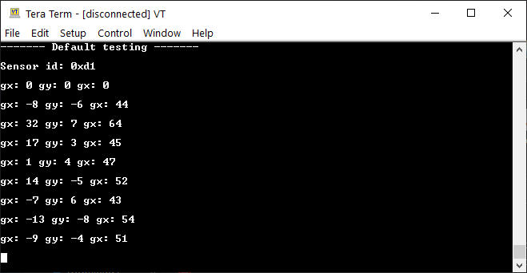

# Interfacing BMI160 sensor in C

This repo contains test code to verify porting of Arduino's SPI and Hanyazou's BMI160 C++ library to C.

Development was done in Atmel Studio 7.0 and tested on an Arduino Uno with ATmega328P microcontroller.

This is part of FYP project to use Bosch's BMI160 sensor in C.

## Credits

Libraries are referenced from:

* [Arduino SPI library](https://github.com/arduino/ArduinoCore-avr/tree/master/libraries/SPI)

* [Hanyazou's BMI160 library](https://github.com/hanyazou/BMI160-Arduino)

Credits goes to them.

## BMI160

Bosch's BMI160 sensor is used and the datasheet can be found [here](https://www.bosch-sensortec.com/products/motion-sensors/imus/bmi160.html).

## Dependencies

Development was done in Atmel Studio 7.0 and certain Atmel Software Framework (ASF) libraries were used.

They include:

* [Delay Routine](https://asf.microchip.com/docs/latest/saml21/html/group__group__common__services__delay.html)

* [IOPORT Service](https://asf.microchip.com/docs/latest/saml21/html/group__ioport__group.html#gabc09edad7c3187dec63ce47e6f1b3c51)

## Expected Output

Currently, only the temperature reading can be obtained as the FYP only requires the temperature reading.

To ensure that the temperature sensor reads the correct temperature value, ensure that the correct sampling settings are configured.

As of now, the code does not support setting the sampling setting, so run the Arduino IDE sketch to configure the sampling settings before flashing this code in the microcontroller to read from the sensor.

The output should look like this:

